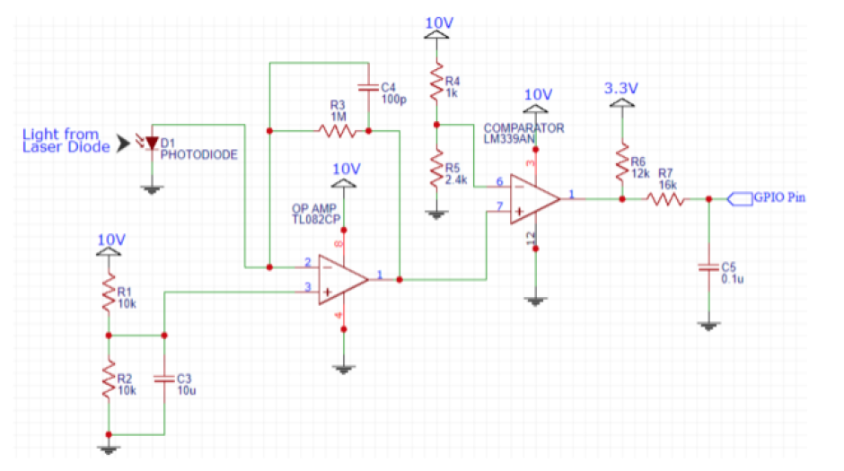
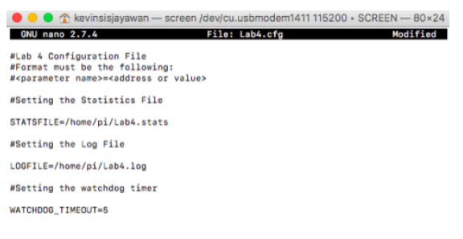
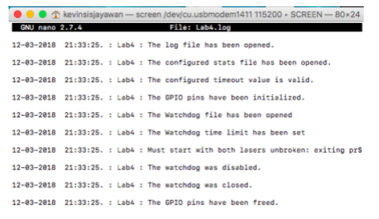
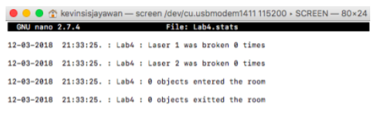

# Summary
This project uses a Raspberry Pi and two lasers to count the number of objects which have entered or exited a room. The main file was implemented with C and includes several GPIO classes as defined in the included header files.

# Hardware
The following is the circuit schematic to process the signal produced by a photodiode using an op-amp and voltage comparator. Since two lasers were used for this project, this circuit was duplicated on the other side of the breadboard.
 

## Equipment used:
- 1 Raspberry Pi Zero
- 1 Operational Amplifier
- 1 Voltage Comparator
- 2 Red lasers
- 2 Photodiodes
- 1 9 Volt battery

# Inputs and Outputs
Once executed, the code reads through a configuration file, such as:

This config file sets the appropriate settings (such as the directory to the log and stats files and the value of the watchdog timeout.

Once configured, it then outputs to a log file, such as:

to log the actions that have been performed.

If a laser was broken, or if an object entered/exited a room, then the stats file would be updated accordingly.

